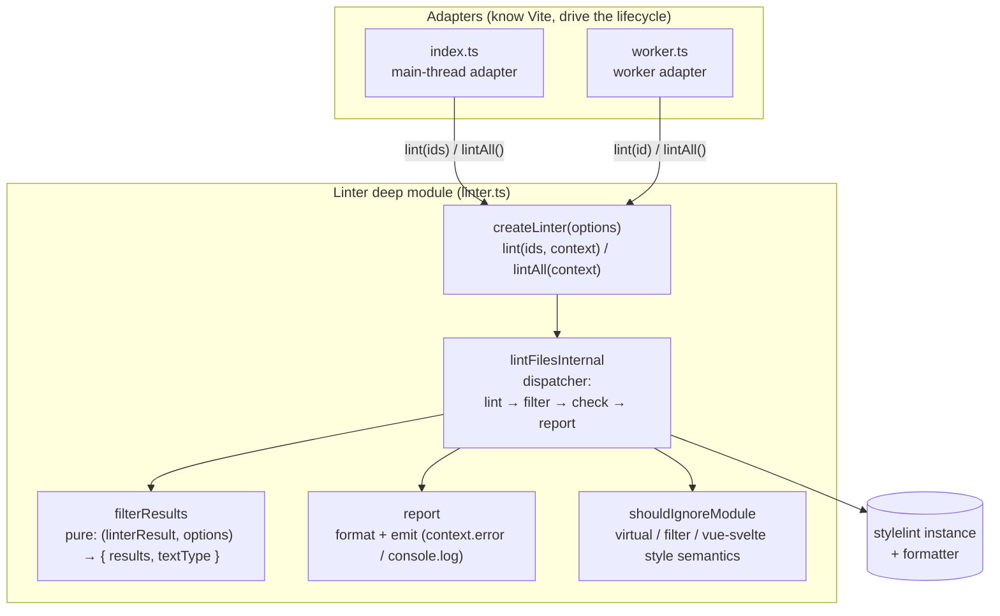

# Contributing to vite-plugin-stylelint

Thanks for your interest in contributing! This guide covers the architecture and how to set up a local development environment.

## Prerequisites

- Node.js `>=20.11.0` (or `>=21.2.0`)
- pnpm `>=10` (enforced via `only-allow`)
- Stylelint v13 ~ v17 if you want to run the examples

## Local development

```sh
# 1. Clone and install
git clone https://github.com/ModyQyW/vite-plugin-stylelint.git
cd vite-plugin-stylelint
pnpm install

# 2. Start the core package in watch mode (builds dist/ on every change)
pnpm dev

# 3. In another terminal, run an example against the local build
pnpm -C examples/react-ts dev
# or: pnpm -C examples/react-ts build
```

The example links to the core package via `workspace:*`, so it consumes whatever is currently in `packages/core/dist/`. Keep `pnpm dev` running while you iterate.

### Useful scripts

| Command | Purpose |
| --- | --- |
| `pnpm dev` | Watch-build all packages |
| `pnpm build` | One-shot build (tsdown → `dist/`) |
| `pnpm type-check` | `tsc --noEmit` across the repo |
| `pnpm test` | Run vitest once |
| `pnpm fix` | Auto-fix formatting (Biome via ultracite) |
| `pnpm check` | Lint check without fixing |
| `pnpm docs:dev` | Run the VitePress docs site locally |

### Verifying a change

Before submitting a PR, run the full check locally — the same commands run in CI / git hooks:

```sh
pnpm fix && pnpm type-check && pnpm test && pnpm build
```

Then exercise the change against the example to confirm runtime behavior:

```sh
pnpm -C examples/react-ts build
```

## Architecture

The plugin runs Stylelint on Vite-processed modules. The coordination lives in a single deep module (`Linter`), with two thin adapters driving it depending on the `lintInWorker` option.



### Module responsibilities

| Module | Role | Knows about |
| --- | --- | --- |
| `index.ts` | Main-thread adapter. Holds `worker` / `linter`. Wires Vite hooks (`buildStart`, `transform`, `buildEnd`). Batches the transform id with its watch files. | Vite plugin lifecycle, worker lifecycle |
| `worker.ts` | Worker adapter. Forwards `parentPort` messages to `linter.lint(id)`. ~25 lines. | Node `worker_threads` only |
| `linter.ts` | The deep module. Owns `createLinter`, `filterResults` (pure, exported for testing), `report`, `shouldIgnoreModule` (exported for testing), and all private collaborators. | Stylelint only — no Vite/worker concepts |
| `utils.ts` | `getOptions` — normalizes user options into defaults. | Options shape only |

### Key design rules

- **The `Linter` is the only place that knows how to schedule one lint pass.** Adapters translate external worlds (Vite hooks, worker messages) into `lint(ids)` / `lintAll()` calls — they never assemble `stylelint.lint(...)` + formatter themselves.
- **`context` is a per-call parameter, not a captured closure.** Vite runs transform hooks concurrently: a shared context would be overwritten between concurrent lints, misrouting emit to the wrong module's `PluginContext`. The main-thread adapter passes `this` at call time; the worker omits it (defaults to stdout-only emit).
- **`filterResults` is pure.** `(linterResult, options) → { results, textType }`, no I/O, no stylelint instance. It is the test surface for the emit-filter / textType logic. `report` (format + emit) stays private — its correctness is validated through `createLinter` and the example.
- **Worker color matches the main thread.** A worker's stdout is a pipe (not a TTY), so picocolors/chalk disable color at module load. `index.ts` forwards the main thread's color support via `getWorkerEnv`, respecting explicit user overrides (`NO_COLOR` / `FORCE_COLOR`) and only forcing color on when the parent is a TTY.
- **`.vue` / `.svelte` style semantics are the opposite of the ESLint plugin.** Stylelint lints `<style>` blocks, so `xxx.vue?type=style` / `yyy.svelte?type=style` modules are **kept**, while plain `.vue` / `.svelte` modules (no `?type=style` query) are **ignored**. See `shouldIgnoreModule`.
- **Plugin options and Stylelint options share one namespace.** `StylelintPluginOptions extends StylelintLinterOptions`. The `PLUGIN_OPTION_KEYS` list (`constants.ts`) separates them by exclusion in `getStylelintLinterOptions`. **When you add a new plugin option, append its name to `PLUGIN_OPTION_KEYS`** — otherwise it is silently forwarded to `stylelint.lint()`. `cache`, `cacheLocation`, `fix`, etc. are intentionally absent from the list because they are real Stylelint options the plugin forwards by design.

### Adding a new plugin option

1. Add the field to `StylelintPluginOptions` / `StylelintPluginUserOptions` in `types.ts` with a bilingual JSDoc comment (match the existing style).
2. Set its default in `getOptions` (`utils.ts`).
3. **Append the field name to `PLUGIN_OPTION_KEYS`** (`constants.ts`). This step is easy to miss and fails silently — without it the option is forwarded to `stylelint.lint()`.
4. If the option affects filtering or the textType decision, extend `filterResults` and add a test in `linter.test.ts`.

## Committing

- Pre-commit (`lefthook`) runs `ultracite fix` automatically. Pre-version also runs `fix`, `type-check`, and `test`.
- Commit messages follow [Conventional Commits](https://www.conventionalcommits.org/) (`feat:`, `fix:`, `refactor:`, `docs:`, `chore:`).
